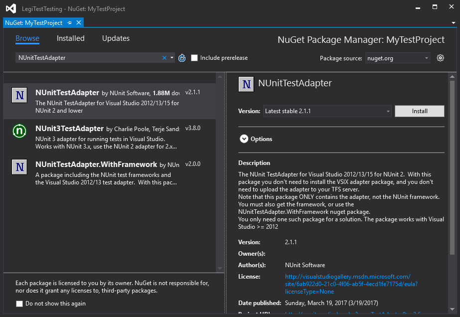



# How do I add a NuGet package reference to my test project?

You may find that you need to add a NuGet package reference to your project - for example, when switching a test project from MSTest to NUnit you would need to add a reference to the 'NUnitTestAdapter' package. To do this, expand the project node in Solution Explorer, right click on the 'References' node and click on 'Manage NuGet Packages...'

In the dialog that is shown, click on 'Browse' and then type the name of the package you want to install. Select the package you want when the search results are returned and click 'Install' in the right hand pane. The NuGet package is then installed in the project.