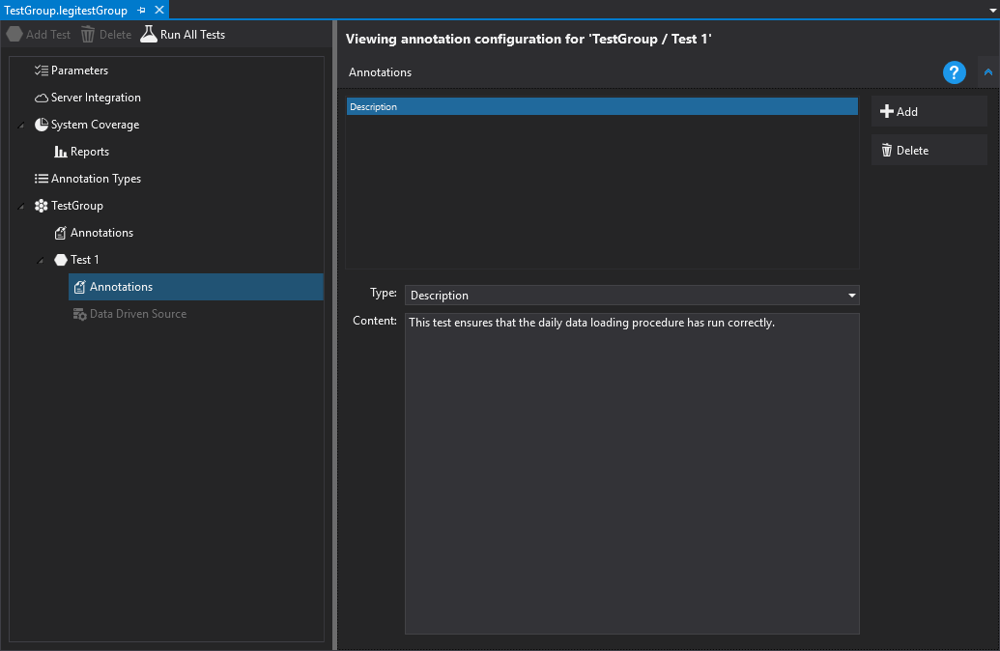
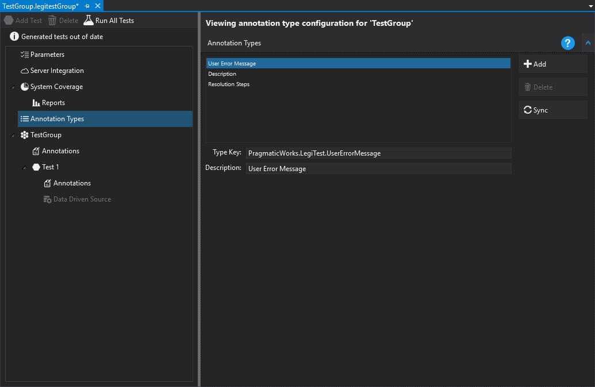



# Annotations

Annotations allow meaningful descriptions to be assigned to tests. These can be useful when business users are trying to make sense of test results on LegiTest Server, and appear on the test management page for a test.

Configuring the annotations in the LegiTest Client is simple. Clicking on the 'Annotations' node under a test brings us to the following display:

Here we can click on 'Add', choose the annotation type and enter some text that relates to the test in question. The built in annotation types are 'User Error Message', 'Description' and 'Resolution Steps'. Custom annotation types can be added by clicking on the 'Annotation Types' node, which will then display a list of the annotation types:

We can add new ones or delete our custom added ones (the built in annotations cannot be deleted). You can click on 'Sync' to synchronize the list of annotation types with the configured LegiTest Server.