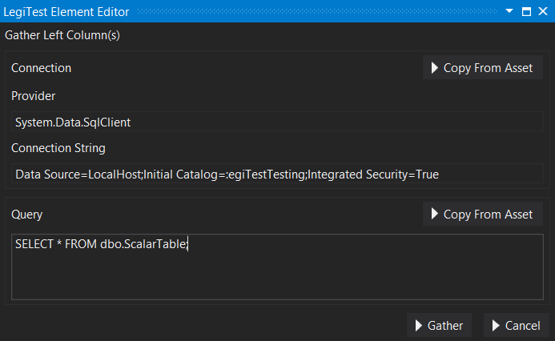
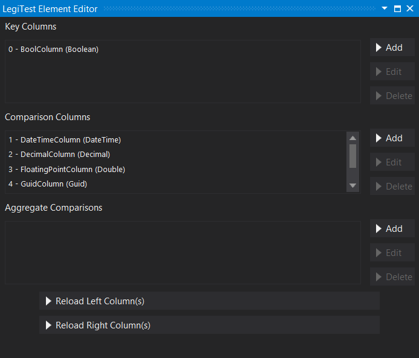
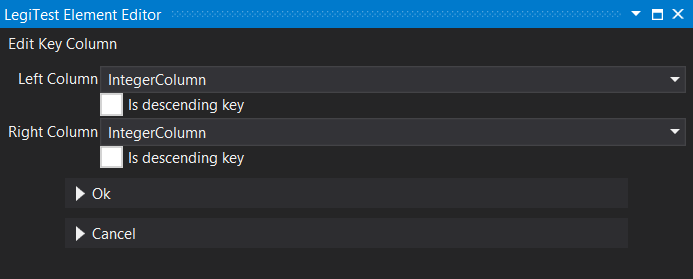
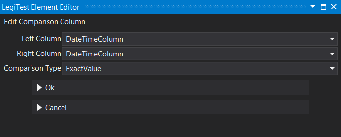
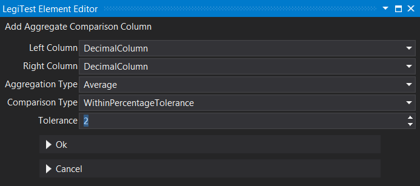


# Comparison Manifest

The comparison manifest asset is used in the grid comparison assert. This asset defines how the two grids in the assert are compared to each other. First the user will need to gather the left side of the comparison, then the right. Once both sides of the comparison have been gathered, then the user may set which columns are compared and how.

### Gather Left Columns / Gather Right Columns

**Connection -** The connection to the location of the data to be compared. The connection can be set from an existing connection asset or typed into the connection string box.

**Query -** The query used to gather the data to be compared. This can be typed in the editor box, or pulled from an existing query asset.

### Comparisons

**Key Columns -** Add, edit, or delete the key columns from each side of the comparison. The user will select the left and right column that match as the key column, and can also specify if the key is descending.

**Comparison Columns -** Set the columns to be compared. Columns with the same name and data type are automatically populated to be compared. In the key columns, the user can also choose a comparison type based on the type of the column. Integers will have fixed tolerance options, and strings will have an exact value option or a string match option with additional parameters.

**Aggregate Comparisons -** Set aggregate comparison of columns. There are several aggregation types to choose form depending on the types being compared, as well as standard choices for comparison types.

