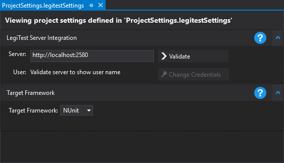



# Connecting to a Server

In order to connect to a server, you need to open the project settings file. By default, this is called ProjectSettings.legitestSettings. When opening the project settings file, a view similar to the following is presented:

Here we can type the URL of the server that we wish to connect to and click 'Validate'. If the server requires credentials (e.g. LegiTest Online) then a popup may be shown requiring you to log in to your account. After the server has been validated, this is shown on the display.

>  Important Note:
> 
> Ensure that the scheme (http / https) is set correctly for the server that you are connecting to. The address required for LegiTest Online is the public API address.
