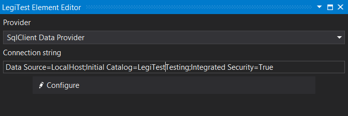
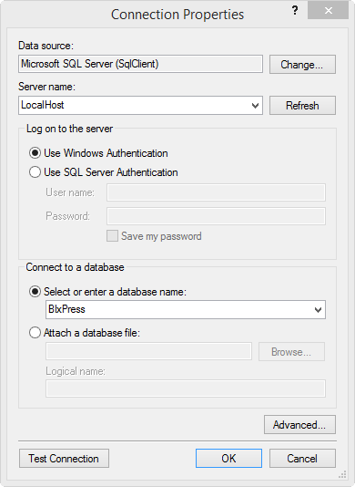


# Connection

The connection asset is designed to help a user create and store a connection string to a data source. If the users knows the connection string, they can simply type it into the Connection string field, otherwise they can make use of the connection string builder. Using the configure button,and selecting other as the provider, a user can even set up a connection to analysis services.

### Connection Editor

**Provider -** The provider type for the connection string.

**Available Providers:**

- **Odbc**

- **OleDb**

- **OracleClient**

- **SqlClient**

- **Microsoft SQL Server Compact 4.0**

- **MySQL**

**Connection String -** The connection string for the data source.

**Configure -** The configure button will launch the connection string builder, and walk the user through creating the connection string that will be stored in the asset.

### Connection Properties Window

**Data Source -** This is the provider type specified in the element's editor.

**Server Name -** The name of the server that the data source is located.

**Log on to the server -** The user can decide whether to use window's authentication or provide a specific user name and password.

**Connect to a database -** The user will either select a database located on the server specified, or opt to attach a database file.

Once all items are populated the user can click Test Connection to ensure that everything connects as expected, once they click OK, the connection string based on the properties provided will populate the connection string field in the element's editor.