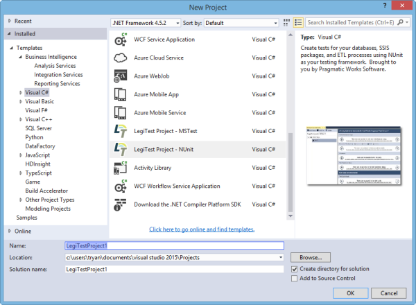



# Creating a New Test Project

1.  Within Visual Studio, click File > New > Project... to launch the New Project window

2.   In the New Project Window, expand the Installed Templates tree and select Visual C#

3.   Scroll down and select the either the LegiTest Project MSTest or NUnit Test template. For help understanding the differences, see the '[Choosing a Test Framework](ChoosingATestFramework.md)' topic.

>  Important Note:
> 
> NUnit tests are shown in the Visual Studio Text Explorer window because the NUnit project type includes a reference to the 'NUnitTestAdapter' MuGet package. This allows the Visual Studio test framework to discover and run NUnit tests. When switching a project from MSTest to NUnit, be sure to add a reference to the NUnitTestAdapter NuGet package. Further instructions on doing that can be found here.

4.   Provide a meaningful name for the LegiTest Project and then click OK.

>  Helpful tip:
> 
> It is advisable to end the project name in 'Tests', as a lot of continuous integration systems will, by default, run tests in assemblies with the word Tests in them.
