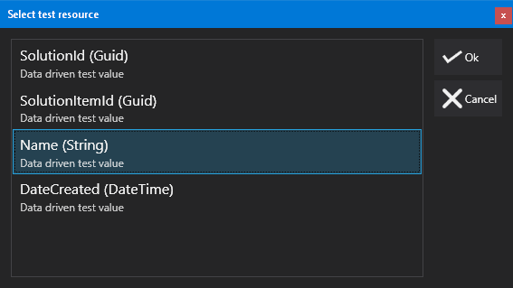

# Data Driven Testing


Data driven testing allows us to repeat the same test many times, based on dynamic source data.


For example, consider the scenario where we want to ensure that the each of a series of 2000 products passes a set of tests. We obviously wouldn't want to create 2000 of the same test. Similarly it might not be possible to write a single query that covers all the test cases - we may want to validate that the results of a REST call for each of the products passes a set of criteria. This is where data driven testing comes in to play.

### Configuring data-driven testing


In the test tree on the left, under each test node is a node titled 'Data Driven Source'. Clicking on this and clicking the check box to enable data driven testing for the test gives us the following view:


Here, much like in the [interactive comparison wizard](InteractiveComparison.md) we are selecting a connection and either entering a query or configuring the source (if using a REST connection, for example). Once we have selected our connection we click Execute to retrieve the results.


**Note:** It is important to understand that the results are only shown in the UI to enable easier configuration. The data returned is **NOT** stored, and the source is run every time the test runs. The only information that is retained is the metadata about the columns, so that they can be used as resources.


One we have configured the source and executed it, we can see that the data is shown:


This test is now configured for data driven testing! In this example, we are using a list of solution items from the DOC xPress metabase.


Now, when selecting resources for our actions / assertions - we can see that the columns returned from our data driven source are reflected in the list of available resources:




We can also use these values wherever we would use parameters normally - so, for example, we could write a query in the form:


```sql
SELECT COUNT(*) FROM LineageService.ItemSets WHERE SolutionItemId = '{{SolutionItemId}}'
```


### Differences between data driven testing in MS Test and NUnit


There are differences in how data driven testing works under the covers between the test frameworks available. For a complete description of the differences, see the framework considerations topic.