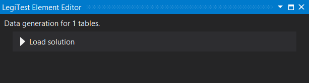



# Data Generation Solution

The Data Generation Solution asset picks an existing data generation solution that was created in Pragmatic Workbench, and is later executed with the Data Generation action.

#### Data Generation Solution Editor

**Load Solution -** Clicking the Load solution button will bring up a file picker window. The user can brows for an existing .dgsln file and load it into the asset. Once loaded, the editor will let the user know how many tables will be affected.