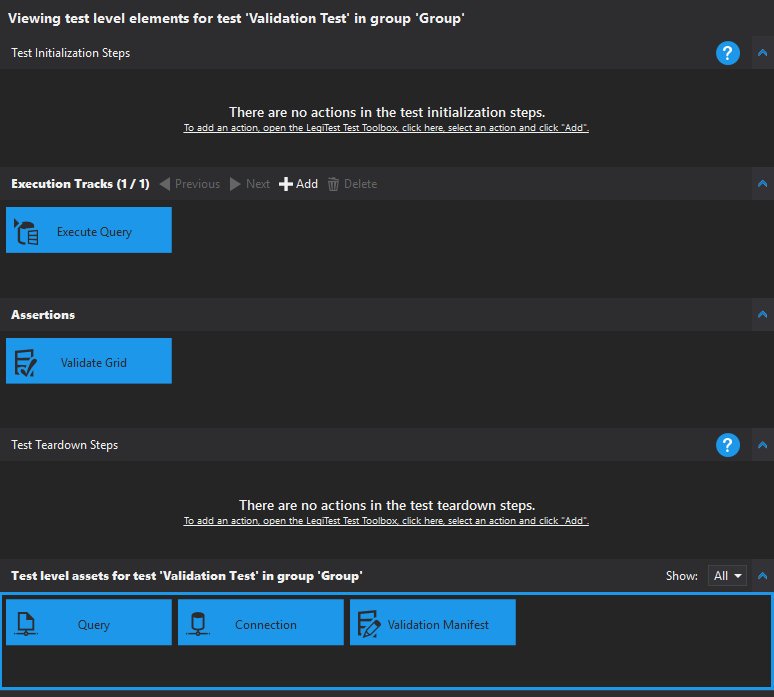

# Data Validation

The data validation wizard allows users to build tests that validate specific query results. This shortens the time it takes to build tests that help detect corrupt or inaccurate data.

### Data Set

When launched, the wizard presents an empty display. The data set window specifies the connection and query used within the data validation wizard.

](images/DataValidationDataSet.png)

To begin, users must configure a connection for use within the data validation wizard. To create a connection, click the 'configure' button. After selecting and configuring the connection properties, users can begin building the query.

'Is Disk Based' specifies whether to store the results within a temporary file or in memory. This option is best used for larger data sets.

The data set query uses the same advanced editor as the [Query Asset](QueryAsset.md). Once satisfied with the query, click "Next."

### Configuration

The configuration window species the columns and aggregates to use within the data validation. Select "Only pass validation if no rows are present" if the user expects the query to return no rows. Otherwise, click "New" to add the first column validation.

Users can add as many validation columns as they wish. This validations can be aggregations or row-by-row comparisons. Users choices for comparison types depend on the data type of the selected column.

Once satisfied with the validation columns, click "Finish"

