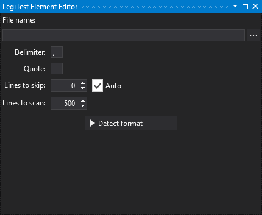
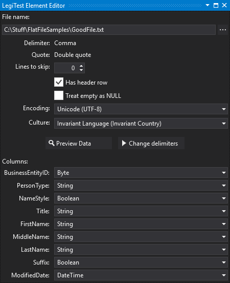



# Delimited File Reference

The Delimited File Reference asset allows the user to select a delimited file and gather information about both it's format and the data it contains.

### Initial view

**File name -**  You can paste the file name here or use the ellipsis button to select a file. A parameterized value may be used in the form %parameterName% or {{parameterName}}.

**Delimiter / Quote -** These are the delimiter and quote that the file has. The asset's format detection routine will always check tab, pipe and comma for delimiters and both single and double quotes for the quote. If your file uses a different delimiter or quote, you can enter them here.

**Lines to skip -** This is the number of rows of pre-amble to skip. You can leave Auto ticked to automatically find out how much pre-amble there is. Note that header rows will be automatically detected.

**Lines to scan -** This is the number of lines of data to scan while detecting column formats.

**Detect format -** Clicking this button will begin the process of detecting the format of the file and columns.

### After scan view

**File name -**  You can paste the file name here or use the ellipsis button to select a file. A parameterized value may be used in the form %parameterName% or {{parameterName}}.

**Format -** This lists the formats that have been evaluated, along with their scores. A higher score indicates better compliance (consistent number of columns across rows and a higher number of columns in total). The format with the highest score will be pre-selected - unless a custom delimiter or quote was specified, in which case the custom format will be pre-selected. Note that the format selection is only available immediately after running the format detection process. When coming back to edit the asset later, this option will disappear.

**Delimiter / Quote -** Shows the currently selected delimiter and quote.

**Lines to skip -** The number of lines of pre-amble to skip.

**Has header row -** Check this is the file has a header row containing column names. The header row comes after any pre-amble.

**Treat empty as NULL -** Check this if empty values should be rendered as null values.

**Encoding -** This is the encoding that will be used to read the file. If your file contains special characters that are represented incorrectly on preview, it is likely that the encoding needs changing.

**Culture -** This is the culture that is used to interpret the source data as typed values. Decimal points and date formats are those where the culture requires particular attention.

**Preview Data -** This button will show the preview of the data using the selected option in a grid view.

**Change delimiters -** This button allows you to change the custom delimiters and run the format detection again.

**Column list -** Each column is presented along with a list of types. This list is derived by attempting format conversion on a variety of formats. You can change the resulting type to any of the allowable formats.