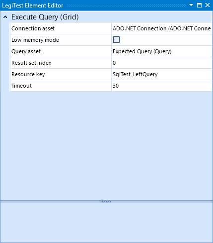

# Design Area

The design area is where the user will add their test elements. The area is divided into the different test flow steps and will change depending if there is a single test or a test group selected. As mentioned in the test flow, elements are executed from left to right, then top to bottom. These elements can be rearranged once placed by dragging and dropping. The elements can be placed on the design area by dragging and dropping from the toolbox, double clicking an item in the toolbox, or right clicking the design area and use the quick add menu.

To open the toolbox, on the visual Studio toolbar, click View > Other Windows > LegiTest Toolbox.

Once an item is placed, an icon may appear on the top right of the element's box. Hovering over this will give the user information on any errors this element has.

Once the tests have been set up, saving the project will automatically generate the test code. Once the project has been built, the test will be discoverable in the test explorer window of Visual Studio. For more information on the flow from design to execution, see the section on [understanding the output](UnderstandingTheGeneratedOutput.md).

A simple comparison test might look like the following:

Looking at the tree nodes on the left - these are covered in more detail in the following sections:

- [Parameters](UsingParameters.md)

- [Server Integration](IntegratingWithLegiTestServerOrL.md)

- [System Coverage](SystemCoverage.md)

    * [Reports](ViewingReports.md)

- [Annotation Types](Annotations.md)

Under that we have the node for the test group, [annotations](Annotations.md) for the group, the test itself, [annotations](Annotations.md) for the test and the [data driven configuration](DataDrivenTesting.md) for the test.

Note that the test and group nodes have a warning icon next to them - this is because some elements require attention. You can see a brief description of the errors by hovering over the warning icon, or you can view the errors in more detail by double-clicking on the icon. This brings up the error inspector:

Double clicking on the icon of an element will bring up it's editor and double-clicking on the text will start editing the name of the element. The element editor is a dockable window within Visual Studio, so you may find it convenient to dock it into a position where it is permanently visible.

Some elements have custom editors which present a more convenient user interface for configuring the element in question.