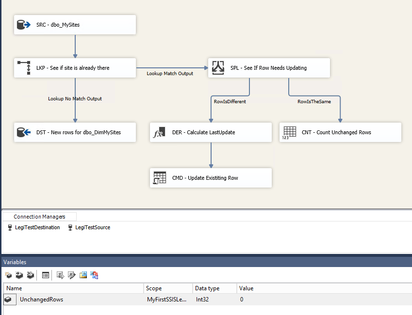

# Designing a LegiTest Test


As you begin to work with LegiTest, a natural first question is “How do you design a test?” In this article we’ll look at just that, using the testing of an SSIS package as an example. The steps though are similar regardless of what you are testing.


1. Understand the object being tested.

2. Identify the assertions which will legitimize the object being tested.

3. Define the actions that need to be taken in order to do the tests.

4. List the assets needed in order for the actions to work.


With LegiTest, the “object being tested” can be a multitude of things. SSIS Packages, data, database objects such as stored procedures and functions, SSRS reports, SSAS cubes and dimensions, and more.


The assertions can be thought of as the way in which we prove the object works as designed. In human readable terms, a test might assert “If the row count from a query matches an entered number, the test passes”.


Actions are the things a test will need to do in order to perform an assertion. For example, running queries, loading packages, running reports, etc. Finally, assets are the things actions need in order to run.

Connection strings, queries, and package references are all examples of assets.


For a more in depth discussion on these, please see [Assets](Assets.md), [Actions](Actions.md), [Asserts and Resources](AssetsActionsAssertsAndResources.md).


**The Package Being Tested**


The first step is to understand the object being tested. The package being used in this post is very simple, but performs a common job in the SSIS world. Take data from a source table, and see if that data is already in the target database based on the Primary Key column. If the data is not present, insert it into the target table. If that data is present, but is different from what is already in the target update the target. Otherwise, if the source and target are the same, increment the unchanged rows variable but otherwise take no action.


Here is a screen shot of the data flow task inside the package we are working with.




As mentioned, this package uses two databases, one a source and one a target, each with one table. In the first database, LegiTestSource, we’ll create one table.


```sql
CREATE TABLE [dbo].[MySites](

       [PrimaryKey] [int] NOT NULL,

       [Name] [nvarchar](250) NOT NULL,

       [URL] [nvarchar](250) NULL

) ON [PRIMARY]
```


Here is an example of the kind of data that might go in it.


```sql
INSERT INTO [dbo].[MySites]

 ([PrimaryKey], [Name], [URL])

VALUES

  (1, 'Pragmatic Works', 'http://pragmaticworks.com')

 , (2, 'LegiTest', 'http://legitest.com')

 , (3, 'Arcane Code', 'http://arcanecode.com')

 ;
```


For our target database, LegiTestTarget, we will create a fake “dimension” table.


```sql
CREATE TABLE [dbo].[DimMySites](

       [PrimaryKey] [int] NOT NULL,

       [Name] [nvarchar](250) NOT NULL,

       [URL] [nvarchar](250) NULL,

       [LastUpdate] [datetime] NOT NULL DEFAULT (getdate())

) ON [PRIMARY]
```


Of course, this isn’t a real dimension table in any sense of the word, in this example we’ll just use the Dim name for illustration purposes.


The package needs two connection managers, one for each database. For this sample they were just made local to the package. Note they were renamed to remove the ‘local.’ SSIS automatically places on the front. The package also has one variable, which will be used to track the number of unchanged rows.


In the package we create, it will do a lookup. If the row doesn’t exist, it will then insert the row into DimMySites. If it does exist, flow goes to the conditional split. In the conditional split the name and URL are compared to see if anything changed.


```sql
(Name != DimName) || (URL != DimURL)
```


The purpose of the derived column transform is to calculate the LastUpdate date for the target table. The variable is LastUpdate, and the expression is simply (DT_DATE)GETDATE().


The contents of the OLEDB CMD destination should be relatively obvious. The command is a simple update statement.


```sql
UPDATE [dbo].[DimMySites]

  SET [Name] = ?, [URL] = ?, [LastUpdate] = ?

WHERE [PrimaryKey] = ?
```


A final note, this is not the optimal way to design a good data warehouse package. Normally the OLEDB Command would not be used, due to its slowness. However this works well for this foray into LegiTest.


Now that we understand the object being tested, in this example the package, how would we go about testing it? What are the types of assertions we could run against this package to ensure it works as designed?


### Assertions


A first, and obvious one is to make sure that after the package executes the number of rows in both tables is the same. Another obvious assertion would be to make sure the data in both tables is the same after the package executes (excluding the LastUpdate column which only exists in the target).


So what else should we test? Looking at the package, there is logic around existing rows. We would of course want to ensure data is updated properly, but that would be covered in the previous test on matching the source to the target. Another part of the logic though, routes unchanged rows to a counter.


A test around this could actually consist of two assertions. The first should validate that the row did not change between the time the package started, and the time it ended. The second should check the row counter. To make this testable, we will need some special data loaded into the target table.


```sql
INSERT INTO [dbo].[DimMySites]

 ([PrimaryKey], [Name], [URL])

VALUES

  (1, 'Pragmatic Works', 'http://pragmaticworks.com')

 , (3, 'arcanecode', 'http://arcanecode.com')

 ;
```


Referring back to the data loaded into the source, the row with Primary Key 1 is the same data. Thus this row should not change during the update process.


The row with Primary Key 3 will be updated, but again that will be tested and validated when the target table is compared to the source table.


As a final test, we want our package to execute in under a set amount of time. Thus we want to get the execute time to ensure it meets the defined parameters.


To sum up the assertions we want to execute within our tests, they are:


1. Assert that the source and target tables have the same number of rows after the package executes. (For the test database we have setup, this will be 3 rows.)

2. Assert that the data, excluding the LastUpdate column (which doesn’t exist in the source), matches between the source and target.

3. Assert that the row that should not be changed (Primary Key 1) was not altered, based on the LastUpdate column.

4. Assert that the UnchangedRows variable containing the unchanged rows row count has a value of 1 after the package executes.

5. Assert that the package executed in under a set amount of time.


At this point we have now identified the assertions that are needed within each test. Now in order to do these tests, what actions do we need to take before we can actually run assertions within our tests?


### Actions


Prior to running individual tests, there are actions that need to be done. These would likely be done at the Group Initialization area of LegiTest.


First, we’ll need to set the source and target databases to a known state. Often the source database will already be in a known state, which is the case here, so we won’t have to do anything within the test.

However we will want to ensure the target database is reset correctly prior to the tests being done.


After the target database is setup, we need to determine how to know whether the row that will be used in our unchanged row has been changed or not. Thus we will need to execute a query to get the LastUpdate date-time for that row before the test executes.


Packages can exist in many different places. As a next step we’ll need to get a reference to the package itself. Once we have that package loaded in memory, we’ll need to run it.


Summarizing, these are the actions that need to be executed prior to running individual tests.


1. Reset the target table to a known state.

2. Execute a query to get the Last Update data for the row that shouldn’t change.

3. Load the package into memory.

4. Execute the package.


Now that the group actions are identified, we know that each test itself will need to run its own series of actions before the assertion in that test can take place. Individual tests within LegiTest follows a typical pattern.


1. Execute one or more actions to determine the state of data after the object (in this example a package) executes.

2. Run one or more assertions which use the output of the actions to determine if the assertion is true or false.


Specific to this test, the actions we take for the first four tests will execute a query action against the database. The final test will perform a get properties action to get the execution time.


###  Assets


With the bulk of the work completed, the final task is to identify the assets needed for the actions to work. The LegiTest being designed here works with two databases, so a connection string for each database will be manifested as connection assets.


In the actions area it was mentioned there will be actions which determine the state of the data. These are queries, and thus a series of query assets need to be generated.


One of the assertions we listed was to compare data between the source and target. To do this, LegiTest needs to know how to map the columns between the two systems. To do that we’ll use an asset called a comparison manifest.


Finally, in order to load a package we’ll need to tell LegiTest where it is. That is done through a package reference asset.


Our asset list can thus be summarized as:


1. Connections to the source and target database.

2. Queries to get row counts for both the source and target tables.

3. Queries to get data for both the source and target tables.

4. Query to get the LastUpdate column.

5. A comparison manifest that will be used to compare the row and source data.

6. A reference to the DimMySites package.


### Summary


As you can see, this is a logical progression you can use to design any LegiTest test. First, before the design of any test begins you must understand what is being tested. Second, identify the ways in which we will be able to validate the object being tested works as designed. After this step it should start to become clear which actions are needed in order to perform the validation. As the fourth and final step, identify the assets which are needed in order to perform the actions and asserts.


To repeat the list we started with:


1. Understand the object being tested.

2. Identify the assertions which will legitimize the object being tested.

3. Define the actions that need to be taken in order to do the tests.

4. List the assets needed in order for the actions to work.


### Sidebar: The Real World


In an optimal world, it would be nice to be able to have everything identified before we did any coding, and laid out so neatly, as we were able to do in this article. We all know though the real world isn’t so neat. The steps listed though can be performed on an iterative basis. Instead of identifying everything up front, this could be done on a test by test basis.


1. Understand the object being tested.

2. Identify the assertion(s) for an individual test.

3. Define the actions needed for that test to perform its assertion.

4. Create the assets for that particular test, or identify and reuse any assets that may already exist.

5. Return to step 1 for creation of the next test.


### What’s Next?


In this tutorial we walked through the design of a LegiTest test, using a SSIS package as illustration. In the [next tutorial](MyFirstSSISLegiTest.md) we’ll implement this design by building a complete LegiTest test around it.