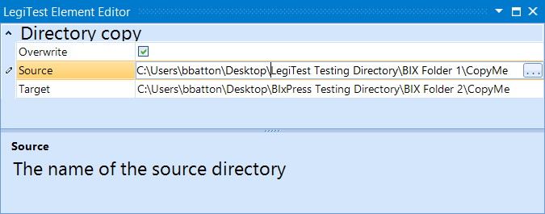



# Directory Copy

Directory copy is used to copy one directory to another location. If the directory trying to be copied does not exist, then it will fail the test.

#### Directory Copy Editor

**Overwrite -**  Enable overwriting of directory contents at the target. If disabled, and the user tries to copy over existing content, the test will fail.

**Source -** The location of the directory to be copied.

**Target -** The location to copy the directory to.