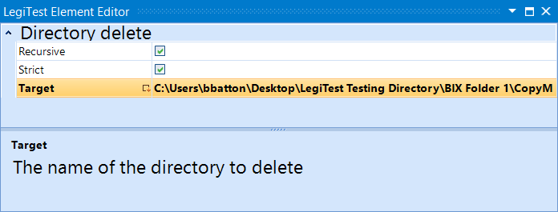



# Directory Delete

Used to delete the target directory. This action has recursive and strict options that can be used to control the behavior of the test.

#### Directory Delete Editor

**Recursive -**  If enabled, the element will delete all sub-directories and files. If disabled and the target directory has content, then the test will fail.

**Strict -** If enabled, and the target des not exist, then the test will fail. If disabled and the target does not exist, then the test will continue on as normal.

**Target -**  Location of directory to be deleted.