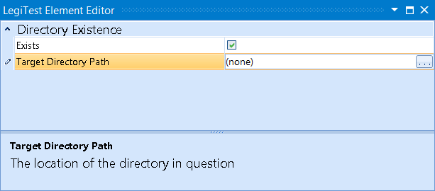



# Directory Existence

The Directory Existence assert will check if a specified directory exists.

#### Directory Existence Editor

**Exists -** If checked, then the assert will check that the directory exists, if unchecked, it will check that the directory does not exist.

**Target Directory Path -** The path to the directory being checked.