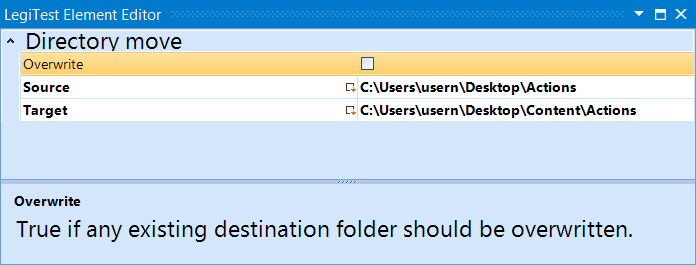



# Directory Move

This action will move a directory from one location to another. The user may also specify to overwrite a directory's contents if the target location already exists.

#### Directory Move Editor

**Overwrite -**  Overwrites the content of the target directory if it already exists.

**Source -** Location of the folder to be moved.

**Target -** Location to move the source folder.