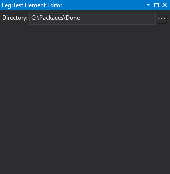



# Directory Reference

The directory reference asset stores a reference to a directory path.

The directory reference asset editor allows you to enter the directory path that you want to reference. You can click the ellipsis to select the directory with a normal directory browser. The path can also be parameterized.