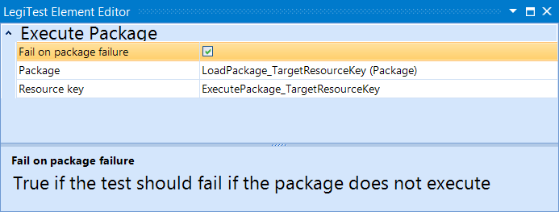



# Execute Package

The execute package action allows the user to launch a package from the test. The user can then decide if the test should fail on package failure or continue.

**Fail On Package Failure -**  Toggle on and off to determine behavior of test on package failure.

**Package -** The resource key of the package to be executed.

**Resource Key -** The result of the package is placed in the resource key.