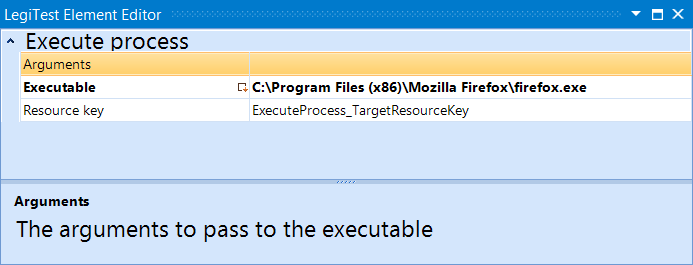



# Execute Process

This action will launch an exe specified by the user, the exit code of the exe launched will be stored in the resource key defined on this element. This can then be used for comparison later in the assert step.

#### Execute Process Editor

**Arguments -**  The user can enter in command line arguments to launch this program with.

**Executable -**  The location of the .exe file to be executed.

**Resource Key -** User defined key that the exit code of the .exe is stored in.