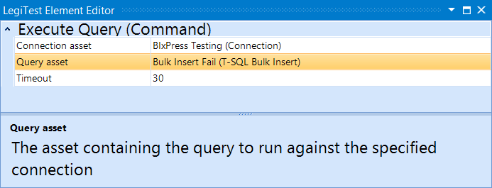



# Execute Query Command

The Execute Query Command action will take a query command specified by the user and run it against the location specified by the user. This element uses various assets to accomplish quickly filling in the required information.

#### Execute Query Command Editor

**Connection Asset -** The connection asset to be used, this determines which database the command is run against.

**Query Asset -** The query command to be executed.

**Timeout -** Controls how long the command will run before failing with a timeout.