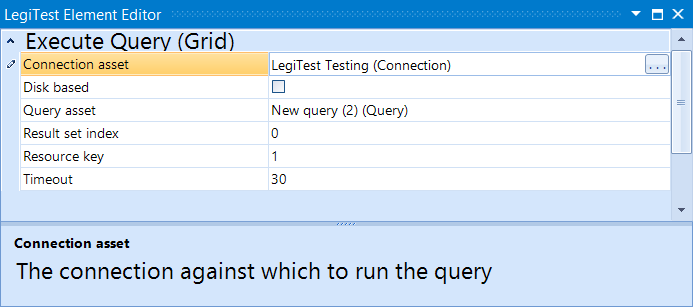



# Execute Query Grid

The Execute Query Grid action will run a query against a connection, then store the information gathered into the resource key defined in the element's editor. This element is used for retrieving a grid of information to be compared in the assertion step. If the query pulls multiple grids, you can specify which grid to use using the Result set index. The default is 0, which is the first result set pulled.

#### Execute Query Grid Editor

**Connection Asset -** The connection to be used for connecting to the data source.

**Disk Based -** Toggles whether the grid should be stored on disk or in memory. Toggle on for larger grids.

**Query Asset -** The query to be run against the connection.

**Result Set Index -** Selects which result set to use if multiple sets are returned from the query.

**Timeout -** Controls how long the query will run before failing with a timeout.