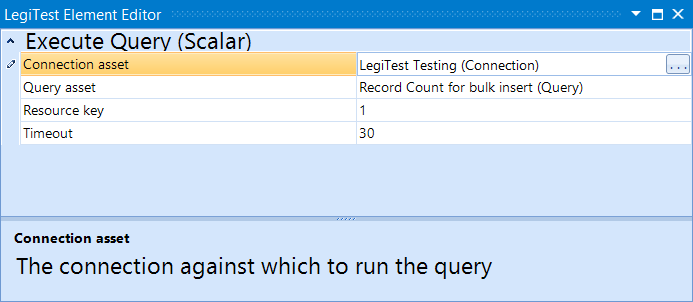



# Execute Query Scalar

This action is used to retrieve a single piece of data to be compared. The data retrieved is then stored in the resource key defined in the element's editor.

#### Execute Query Scalar Editor

**Connection Asset -** The connection to be used for the query.

**Query Asset -** The query to be run against the connection.

**Resource Key -** The resource key where the data is stored from this element.

**Timeout -** Controls how long the query will run before failing with a timeout.