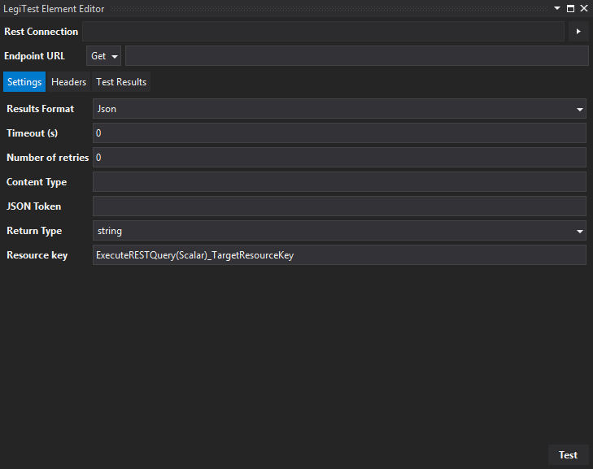
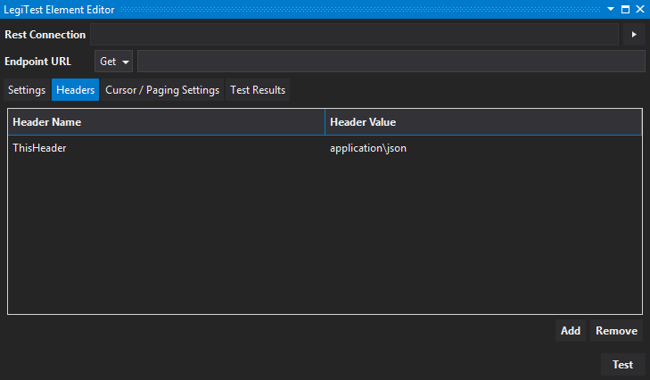
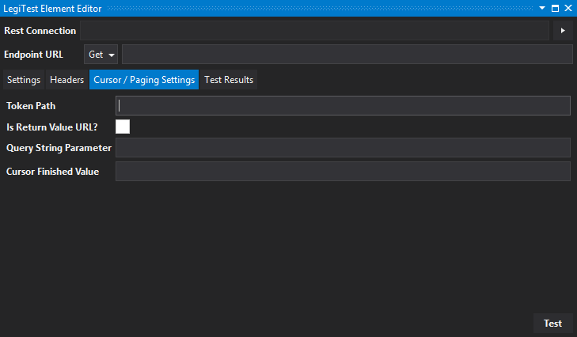
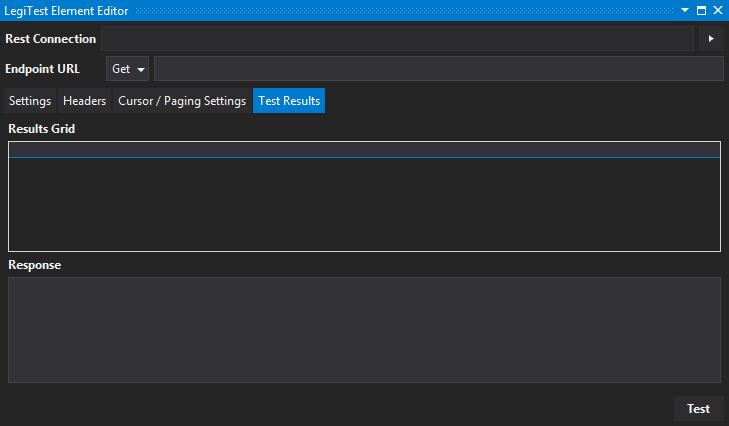



# Execute REST Query (Grid)


The Execute Rest Grid performs HTTP Request. It parses and stores the response (table) values into a resource grid.




**Rest Connection -** The cloud connection created in the test group level or test level asset.


**Endpoint URL -** The web address that accepts the web request. Endpoints can use the following actions:

- **Get -** Retrieves information from the endpoint.

- **Post -** A request that the endpoint perform "something" with the provided information.


**Settings Tab**


**Results Format -** Users select whether results will be returned in Json or Xml format.


**Content Type -** The information needed to send in the header (ie. application\json, application\javascript, application\xml, etc.)


**Root Json Path -** Json can return results that have several root objects. Each object contains corresponding data. Identifying the root will only return the results for that root.

Example: 
```json
{

   "data": {

        "id" : "1",

        "data1column": "test1"

               }

    "data2": {

                "data2key": "1",

                "data2column:" "test2"

                  }

}
```


Setting the root Json path to "data" will only return the results "id" and "data1column." Setting the root Json path to "data2" will only return "data2key" and "data2column" results.


**Timeout (s) -** Sets the amount of time (in seconds) the request should fail if there is no response from the web service.


**Number of retires -** Sets the number of attempts to connect before the execution fails and reports an error.


**Resource key -** Identifies the tile's name. This name helps users if it needs to be used in the Execution Track, Assert, or Teardown steps of the test.


**Grid Column(s) -** The user defined column names, token paths, and data types for each column. Using the Json example above, users can add 2 columns with the data root Json path.

Example:

| Column Name | Token Path | Data Type |
|-------------|------------|-----------|
| ID          | id         | System.Int64 |
| NameOfTest  | data1column | System.String


Column Name are user-defined. The token path must be exactly the same as the path it is pointing to in the returned Json data. (Notice "id" and "data1column" paths identified in the Json example above.)


**Headers Tab -** Headers are simply information about the type of data returned.

Users can add and remove headers by clicking the corresponding buttons. Once a header is added, click in its corresponding name and value fields to configure them.




**Cursor / Paging Settings**


**Token Path -** Identifies the child token being used.


**Is Return Value URL -** Select option if the Token Path is a URL.


**Query String Parameter -** Identifies the (optional) parameters needed to complete the Json request.


**Cursor Finished Value -** The value needed to identify the output data is complete.




**Test Results Tab**




Click the Test button to see the results returned based on the configuration in the previous tabs.