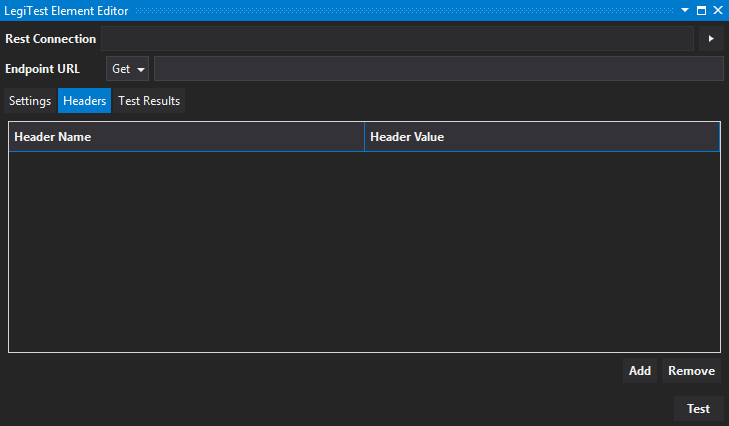
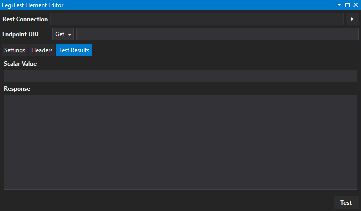



# Execute REST Query (Scalar)


The Execute Rest Query (Scalar) performs HTTP Requests that parses and stores the response value into a resource grid.


**Rest Connection -** The cloud connection created in the test group level or test level asset.


**Endpoint URL -** The web address that accepts the web request. Endpoints can use the following actions:

- Get - Retrieves information from the endpoint.

- Post - A request that the endpoint perform "something" with the provided information.


**Settings Tab**


**Results Format -** Users select whether results are returned in Json or Xml format.


**Content Type -** The information needed to be sent in the header (ie. application\json, application\javascript, application\xml, etc.)


**Root Json Path -** Json can return results that have numerous root objects with corresponding data for each root. Identifying the root will only return the results for that root.

Example: 
```json
{

   "data": {

        "id" : "1",

        "data1column": "test1"

               }

    "data2": {

                "data2key": "1",

                "data2column:" "test2"

                  }

}
```


Setting the root Json path to "data" will only return the results "id" and "data1column."


**Timeout (s) -** Sets the time (in seconds) the request action should take place before it is determined to be a failure.


**Number of retires -** Sets the number of attempts to connect before the execution fails and reports an error.


**Resource key -** Identifies the tile's name to be easily identified should it need to be called in the Execution Track, Assert, or Teardown steps of the test.


**Grid Column(s) -** The user defined column names, token paths, and data types for each column. Using the Json example above, users can add 2 columns with the data root Json path.

Example:

| Column Name | Token Path | Data Type |
|-------------|------------|-----------|
| ID          | id         | System.Int64 |
| NameOfTest  | data1column | System.String


Column Name can be user-defined, however, the token path must be exactly the same as the path it is pointing to in the returned Json data (notice "id" and "data1column" paths identified in the Json example above.)  


**Headers Tab -** Headers are simply information about the type of data returned.

Users can add and remove headers by clicking the corresponding buttons. Once a header is added, click in its corresponding name and value fields to configure them.




**Test Results Tab**




**Scalar Value -** Users can add their own data to populate the column only when testing their configuration.


Click the Test button to see the results returned based on the user's configuration in the previous tabs.