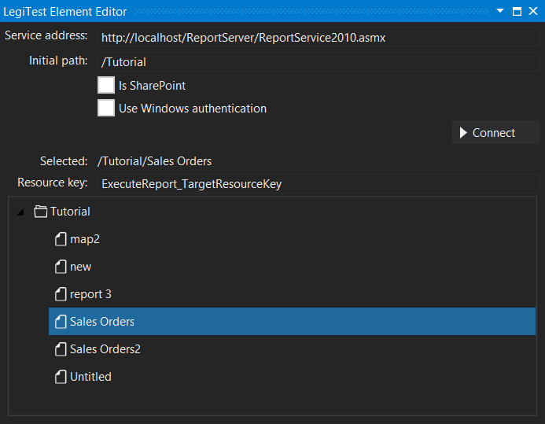



# Execute Report

The execute report action will run a report and store the XML of the report into the resource bag using the resource key. This XML can then be used with an XPath extract action to get a value from a selected node.

#### Execute Report Editor

**Service Address -** This is the server name for the location of reports.

**Initial Path -** The path to the report to be executed.

**Is SharePoint -** Toggle on and off to specify if the report is SharePoint or not.

**Use Windows Authentication -** Toggle on and off to specify whether to use Windows Authentication or not.

**Resource Key -** The resource key name to store the data returned by running the report.

**Parameters -** If the report has any parameters, then the UI will extend to allow input of these parameters.