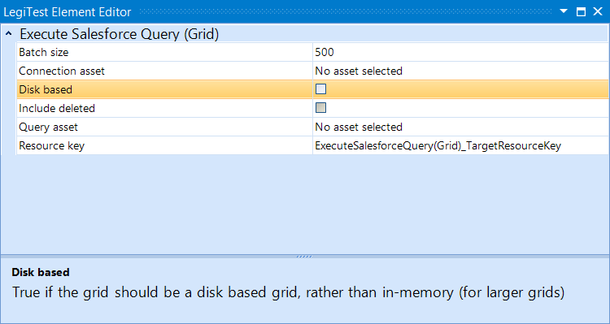



# Execute Salesforce Query Grid

The Execute Salesforce Query Grid action allows the user to execute a query to gather a data grid from Salesforce.

#### Execute Salesforce Query Grid Editor

**Batch Size -** This option allows the user to set the amount of records retrieved from Salesforce per trip. The max records in a batch is 2000.

**Connection asset -** The connection asset will contain the connection string to the Salesforce source.

**Disk based -** The user can select this option will then store the results on disk instead of on memory. This option is recommended for large result sets.

**Include deleted -** Checking this option will include deleted records in the result set.

**Query asset -**  The asset which contains the query to be executed.

**Resource key -**  The name given to the results that is then stored in the Test Resources.