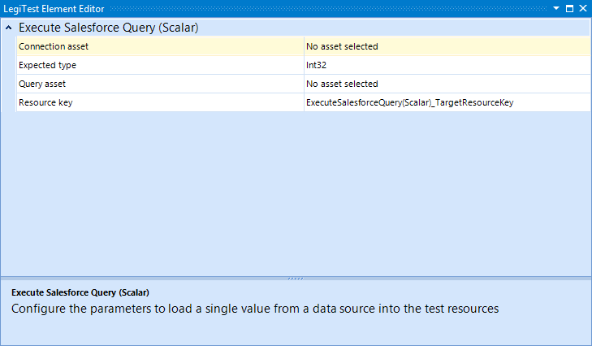



# Execute Salesforce Query Scalar

The Execute Salesforce Query Scalar action allows the user to execute a query that gathers a single value from Salesforce.

#### Execute Salesforce Query Grid Editor

**Connection asset -** The connection asset will contain the connection string to the Salesforce source.

**Expected type -** Defines the expected datatype that is returned.

**Query asset -**  The asset which contains the query to be executed.

**Resource key -**  The name given to the results that is then stored in the Test Resources.