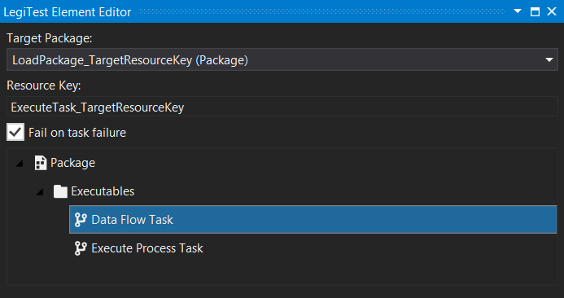



# Execute Task

The execute task action is used together with a package reference and load package element. The user will select the task they wish to execute and once the test runs, only the selected task will be performed.

**Target Package -** The resource key of the package to be used from a previous load package action.

**Resource Key -** The resource key in which to store the result of the package.

**Fail on task failure -** Specify whether or not to fail the test if the task being executed fails.

**Package Selection Window -**  A list of available task from the chosen package will be listed here for selection.