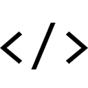
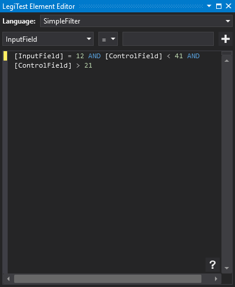



# Expression

The expression assertion is an assertion that lets you enter a free-form expession in order to be able to use more powerful combinational logic in order to validate that one or more resource values are correct.

#### Expression Editor

Language allows you to select the expression language - currently only the 'SimpleFilter' language is available.

Below that is the filter expression, along with some helper controls that allow you to easily add items to the expression. To add a clause to the expression, simply select the resource in the left hand combo box, choose the operator in the middle combo box and type the value you require in the right hand text box. Clicking the '+' button will then add the specified clause to the expression. For more information about filter expressions, please see the [filtering](Filtering.md) topic.

Help on the filtering language is also available in the editor directly by clicking on the '?' icon in the bottom right.

>  Helpful tip:
> 
> Often when filtering, whether in SQL or using LegiTest filters, the identifiers relate to field names. In this instance, the identifiers relate to resource keys. For example, if there was an Execute Query Scalar action which generated a resource called 'MyScalarValue' then the expression could include a clause such as '[MyScalarValue] > 10'
