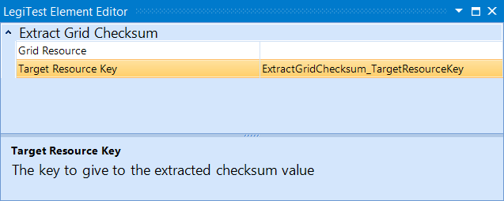



# Extract Grid Checksum

The Extract Grid Checksum action gives a user a simple and quick way to check for changes in a grid set. This action would be used in conjuction with an integer compare assert. The grid checksum takes in a grid, and then returns out an integer that represents it's current state. This integer state can then be compared to another integer to see if there has been any changes to the structure or content of the grid.

#### Extract Grid Checksum Editor

**Grid Resource -** The grid in which to extract the checksum.

**Target Resource Key -** The name given to the result in the Test Resources. This key is used when populating an assert.