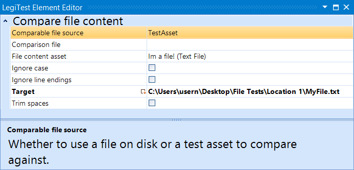



# File Content Comparison

This assert is used to compare the contents of two files or the contents of one file against a File Content asset. The user can specify several parameters to meet their comparison needs.

#### File Content Comparison Editor

**Comparable File Source -** Select whether to compare a file to a File Content Asset or to another file.

**Comparison File -** If the user selected to compare a file to a file, this will be the comparison file's location. Otherwise, if using a File Content Asset, this can be left blank.

**File Content Asset -** If the user selected to use an asset to compare their file to, then the user would select the File Content Asset here.

**Ignore Case -** Toggle on and off to specify if the comparison should ignore letter case.

**Ignore Line Endings -** Toggle on and off to specify if the comparison should ignore line endings.

**Target -** The location of the file being compared.

**Trim Spaces -** Toggle on and off to specify if spaces on the end of the file should be ignored.