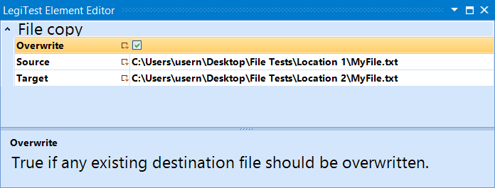



# File Copy

The file copy action is used to copy a file from one location into another. If the file to be copied does not exist then the test will fail.

#### File Copy Editor

**Overwrite -** Determines if the element should overwrite an existing file at the target location. If this is not checked, and the file already exists at the target location, then the test will fail.

**Source -** Location of the file to be copied.

**Target -** Location to copy the file to.