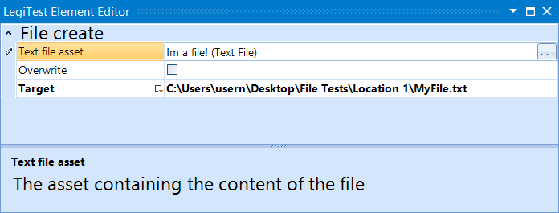



# File Create

The file create action is used to create a file based on a text file asset. This will create the file with the information contained in the text file asset.

#### File Create Editor

**File Content Asset -** The text to be put into the file upon creation.

**Overwrite -** Determines if the element should overwrite an existing file at the target location. If this is not checked, and the file already exists at the target location, then the test will fail.

**Target -** Location to create the file.