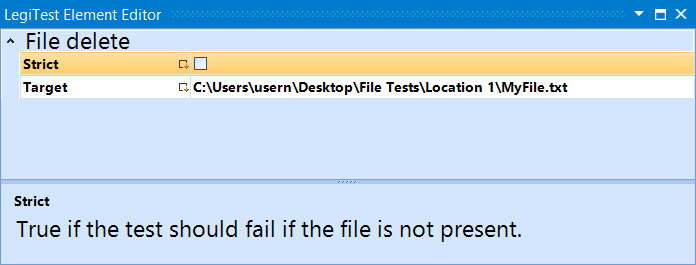



# File Delete

This action is used to delete a file from the target location. If the file does not exist, the user can control if the test should fail or continue using the strict option.

#### File Delete Editor

**Strict -** Determines whether the test should fail or continue if the target file does not exist. If checked, and the file does not exist, the test will fail.

**Target -** The location of the file to be deleted.