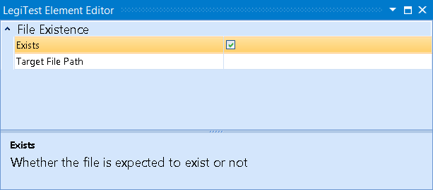



# File Existence

The File Existence assert will check if a specified file exists.

#### File Existence Editor

**Exists -**  If checked, then the assert will check that the file exists, if unchecked, it will check that the file does not exist.

**Target File Path -** The location of the file to be checked.