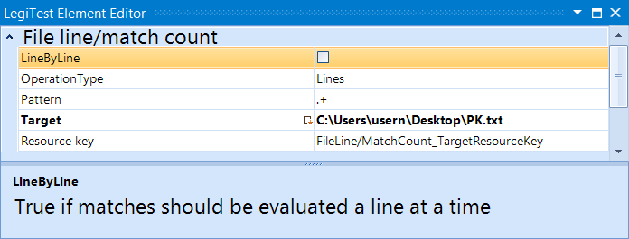



# File Line / Match Count

This action will either count lines in a file, or matches according to a specified pattern. The result of the count is then stored in a resource key to be used for comparisons in the assert step.

#### File Line / Match Count Editor

**Line By Line -**  Toggle on and off to determine if matches should be evaluated a line at a time.

**Operation Type -** Specifies if the element is to count lines or matches.

**Pattern -** This is the regular expression that will be used to count matches.

**Target -** The file to be counted.

**Resource Key -** The result of the count is stored in the resource key.