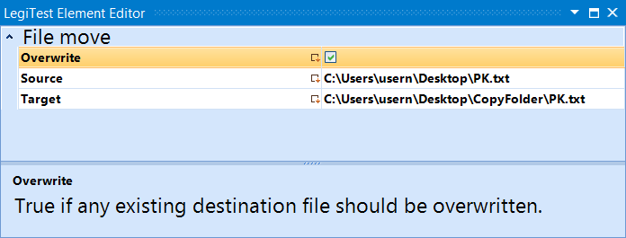



# File Move

The file move action will move the file from one location to another. The user can specify if the element should overwrite an existing file or not.

#### File Move Editor

**Overwrite -** Toggle on and off to specify if th element can overwrite a file that already exists. If turned off, and the file exists at the target location, then the test will fail.

**Source -** The location of the file to be moved.

**Target -** Where the file will be moved to.