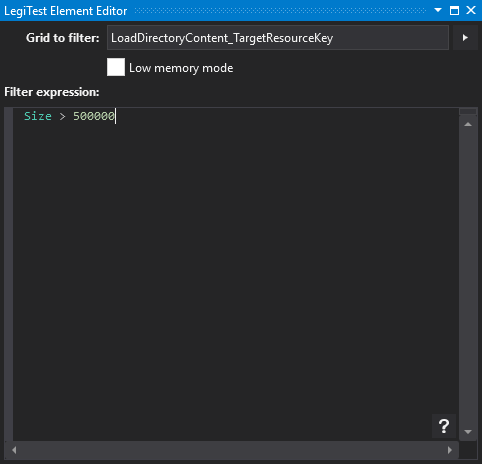



# Filter Grid

The Filter Grid action provides a way to filter an already loaded grid. If possible, avoid using this action. For example - if the grid being loaded comes from an [Execute Query Grid](ExecuteQueryGrid.md) action, then modifying the query to perform the filtering at source will perform better. It is not always possible to run sufficient filtering at source - and this is why the filter grid action is present.

#### Filter Grid Editor

**Grid to filter -** The grid which should be filtered.

**Filter expression -** The filter expression to use. For more information about filter expressions, please see the filtering topic.