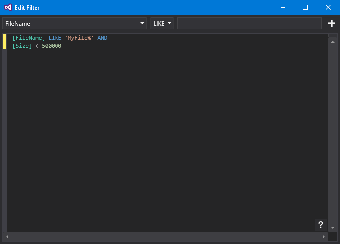



# Filtering




The filtering window is available through the 'Edit Filter' button of some actions (such as the [Load Flat File Data](LoadFlatFileData.md) and [Load Directory Content](LoadDirectoryContent.md) actions).


At the top of the filter window are drop downs which relate to the column, the operator and an area where the value can be entered. Clicking the '+' icon will add this clause to the end of the filter.


### Filter Expressions


Filter expressions are very similar to SQL WHERE clauses. You can enter text that refers to column names and uses operators to compare with other columns or static values. Filter expressions also support combinational logic using AND/OR.


### Samples


```sql
[Size] > 50000


[DateModified] BETWEEN '2017/01/01' AND '2017/02/01'


[CustomerName] LIKE 'Fred%' AND [OrderComplete] != 1
```


### Available Operators


```sql
=: Equals


!=: Not Equal


<>: Not Equal


>: Greater Than


>=: Greater Than Or Equal To


<: Less Than


<=: Less Than Or Equal To


!>: Not Greater Than


!<: Not Less Than


LIKE: Value matches SQL-style string pattern


NOT LIKE: Value does not match SQL-style string pattern


BETWEEN: Value falls between [x] and [y]
```


### Combinational Operators


AND/OR can be used to combine expression clauses, and parenthesis can be used to group clauses.


```sql
[a] = 5 AND [b] = 2 AND [c] = 9


[a] > 1 AND ([b] > 10 OR [c] > 20)
```


### Static value formatting


Values are formatted as they would be in SQL. Strings, GUIDs and Date/Time values are enclosed in quotes, boolean values are 0 or 1 and numeric values are represented naturally.


String: 'a string'


GUID: '6264E1FD-D1DA-49B2-977E-5BAD05BCAC9D'


Date/Time: '2017/03/01'


Boolean: 1


Integer: 16107


Float: 753.452

