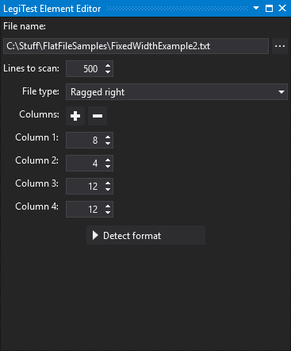
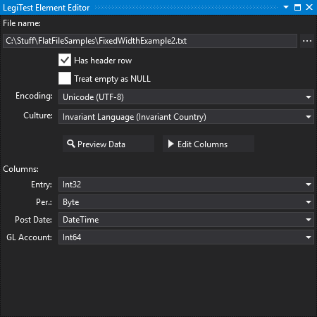



# Fixed Width File Reference

The Fixed Width File Reference asset allows the user to reference a fixed width file and, after specifying the column widths, determine what format data each column represents.

#### Initial view

**File name -**  You can paste the file name here or use the ellipsis button to select a file. A parameterized value may be used in the form %parameterName% or {{parameterName}}.

**Lines to scan -** This is the number of lines of data to scan while detecting column formats.

**File type -** This is the type of flat file that is being referenced. Three file types are available:

- **Ragged right -** This is a file where the last column is not fixed width, with each line terminated by a carriage return and/or line feed. A line will be parsed if it is at least as long as the sum of the widths of all but the last column.

- **Fixed width with line breaks -** This is a file where lines terminated by a carriage return and/or line feed. A line will be parsed if it is at least as long as the sum of the widths of all columns.

- **Fixed width without line breaks -** This is a file where there are no line breaks, and the data comes in a continuous stream. Every x characters are parsed where x is the sum of the widths of all columns.

**Columns -** This is the list of column widths that will be parsed from the file. You can use the '+' and '-' buttons in order to add or remove columns to/from the end of the list. Alternatively, you can place the caret in the first column width box, type the width and then press enter. This will add a new column where you can repeat the same process. Note that pressing enter in a width box will only add a new column if you are currently in the last box. Pressing enter on any other boxes will move focus to the next box.

**Detect format -** Clicking this button will begin the process of detecting the format of the columns.

#### After scan view

**File name -**  You can paste the file name here or use the ellipsis button to select a file. A parameterized value may be used in the form %parameterName% or {{parameterName}}.

**Has header row -** Check this is the file has a header row containing column names. The header row comes after any pre-amble.

**Treat empty as NULL -** Check this if empty values should be rendered as NULL values.

**Encoding** - This is the encoding that will be used to read the file. If your file contains special characters that are represented incorrectly on preview, it is likely that the encoding needs changing.

**Culture -** This is the culture that is used to interpret the source data as typed values. Decimal points and date formats are those where the culture requires particular attention.

**Preview Data -** This button will show the preview of the data using the selected option in a grid view.

**Change delimiters -** This button allows you to change the custom delimiters and run the format detection again.

**Column list -** Each column is presented along with a list of types. This list is derived by attempting format conversion on a variety of formats. You can change the resulting type to any of the allowable formats.