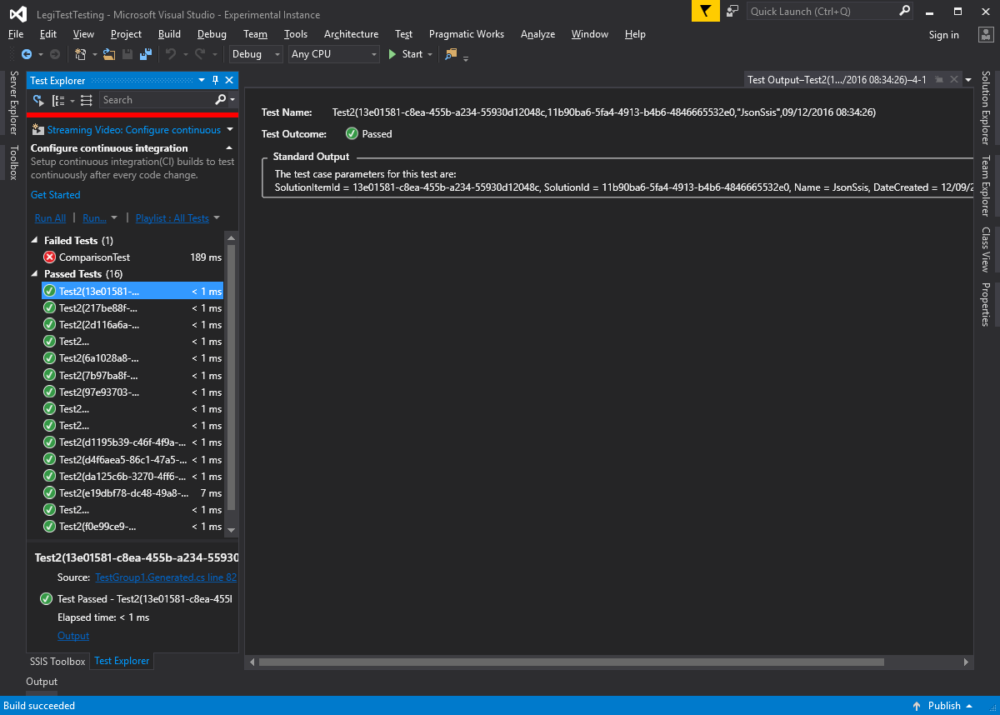

# Framework Considerations

Data driven testing is implemented slightly differently under MS Test and NUnit. Both will evaluate the data driven source during the 'discovery' phase of the test and use the output of that to generate the list of iterations. However - there are some differences in the output that you will see from each because the test frameworks are designed differently.

### MSTest

When using MSTest - each iteration of the test is reported under a single test in the test explorer. When looking at the output for this test, you will see several different runs. Each one has a link that says 'output' - this link can be clicked to get a summary of the rows of data used for that test. When examining the output of an individual test, the display will look similar to this:

As a technical note, MS Test data driven tests generate an XML file containing the test cases during the discovery phase. This is then used as the source of the test data using the DataSource attribute.

### NUnit

When using NUnit - each iteration of the test is reported as an individual test. This can make it a lot easier to identify the tests. Here is a similar display, where we are looking at the output of an indifividual test iteration and viewing the output.

The tecnhical implementation of the NUnit back end is slightly cleaner than MSTest - in that NUnit supports the TestCaseSource attribute. This means that the test data does not have to be written to disk first.