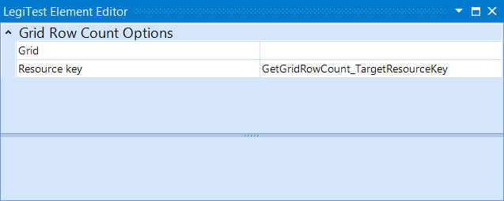



# Get Grid Row Count

The Get Grid Row Count action is a simple that action that takes in a grid and returns the amount of rows in the grid.

#### Get Grid Row Count Editor

**Grid -** The grid to get the row count from.

**Resource key -** The name given to the result stored in the Test Resources.