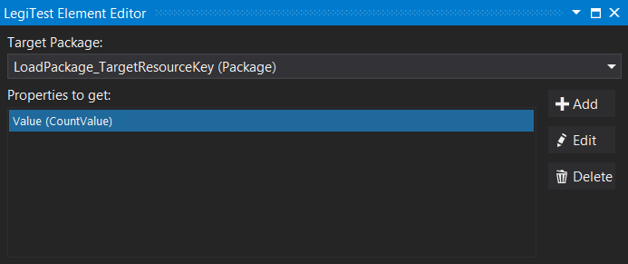
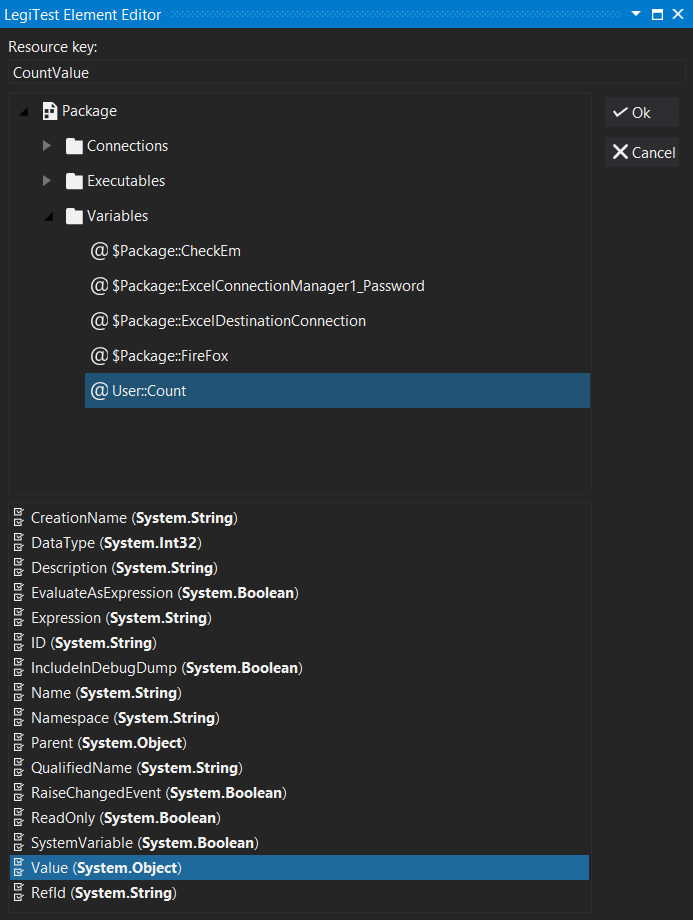



# Get Properties

The get properties action is used to get the properties of various items of a package. One such use would be to get the value of a variable, or the type of a parameter or variable.

**Target Package -** The package reference key from the previous load package action.

**Properties to get -** A list of properties to retrieve when this action is run.

**Add -** When the user clicks the add button, they are taken to the add property window. From here the user will select the package, and then the object, and then the property. The value of the property can be set to a resource key defined at the top of the editor.

**Edit -** When the user clicks the edit button, they are brought back to the add screen with the selected property in focus.

**Delete -**  Deletes the selected property from the get list.

Example:

In this image, the data type of the count variable is being retrieved and stored in the resource bag with the key CountValue.

