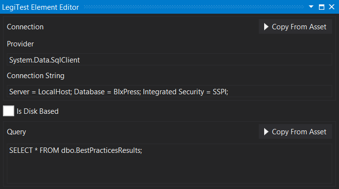



# Grid Collection

The grid collection is used to store the details of a grid that can be used over and over using the Load Grid from Asset action. The user will supply a connection string and a query that pulls the information for the grid. Both the connection and the query can be typed or pulled from another asset.

#### Grid Collection Editor

**Connection -** Connection string to the data source, can either be typed manually or pulled from an existing connection asset.

**Is Disk Based -** Store the query restuls within a temporary file instead of in memory. This option is best used for larger data sets.

**Query -** The query responsible for gathering the data for the grid.