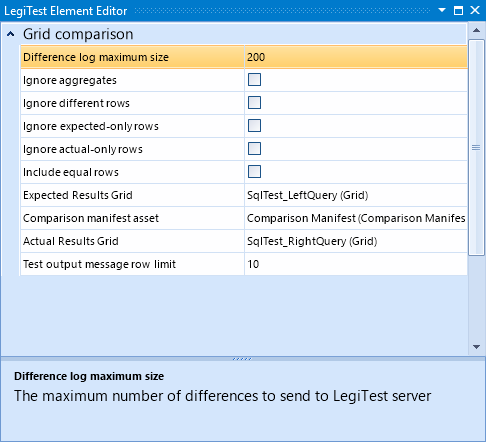



# Grid Comparison

The grid comparison assert will compare two grids, it expects both sides to be equal. The user can specify different criteria for the comparison to be made.

#### Grid Comparison Editor

**Difference log maximum size -** This is the maximum number of rows to send to LegiTest server if the test suite / group is configured to send results to the server.

**Ignore aggregates -** Toggle on and off to specify if aggregate comparisons should be ignored.

**Ignore different rows -** Toggle on and off to specify if rows that differ should be ignored.

**Ignore expected-only rows -** Toggle on and off to specify if rows only appearing in the expected grid should be ignored.

**Ignore actual-only rows -** Toggle on and off to specify if rows only appearing in the actual grid should be ignored.

**Include equal rows -** Toggle on and off to specify if rows that match are sent to LegiTest server. By default, only rows that differ or exist on only one side of the comparison are sent.

**Expected results grid -** This is the grid of 'expected' results - i.e. the result set that we want our test to match. A previous action should load the grid to a specific resource key.

**Comparison manifest asset -** This is the [comparison manifest asset](ComparisonManifest.md) that determines what items are compared.

**Actual results grid -** This is the grid of 'actual' results - i.e. the result set that our test produced. A previous action should load the grid to a specific resource key.

**Test output message row limit -** When the comparison fails an error message is produced and visible in the test runner. This specifies how many detail rows may be included in that message.