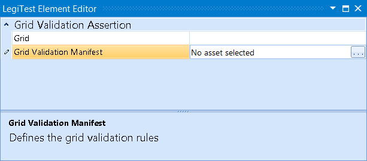



# Grid Validation Assertion

The Grid Validation Assertion is usedwith a Validation Manifest. The assertion will use the rules outlined in the Validation Manifest and run the asserts to validate the grid.

#### Grid Validation Assertion Editor

**Grid -** The grid in which to run validation against.

**Grid Validation Manifest -** The validation manifest containing the validation rules used in the assert.