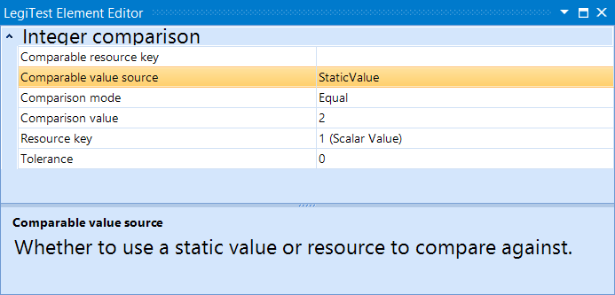



# Integer Comparison

>  Important Note:
> 
> The Integer Comparison assertion is now deprecated. While existing projects can still continue to use it, new products should migrate to using the [Value Comparison](ValueComparison.md) assertion.

The integer comparison assert will test two integers for different levels of equality. The user can specify to test for greater than, less than, or even user defined tolerances. The integer to compare your actual value to can either be a static value defined in the element's editor, or from another resource key.

#### Integer Comparison Editor

**Comparable Resource Key -**  If the user opts not to use a static value to compare to, they would select a resource key here to compare against.

**Comparable Value Source -** Specifies if the element should use a static value or a resource key to make the comparison with.

**Comparison Mode:**

       

- **Equal -** Asserts that the two integers are equal.

- **NotEqual -** Asserts that the two integers are not equal.

- **LessThan -** Asserts that the integer is less than the static value or resource.

- **GreaterThan -** Asserts that the integer is greater than the static value or resource.

- **Within Percentage Tolerance -** Asserts that the integer is within a specified percent of the        static value or resource.

- **Within Fixed Tolerance -** Asserts that the integer is within the specified tolerance range of        the static value or resource.

**Comparison Value -** The static value to be used if the user opts for static value over resource.

**Resource Key -** The resource key of the integer to be compared.

**Tolerance -** Specifies the fixed or percent tolerance.