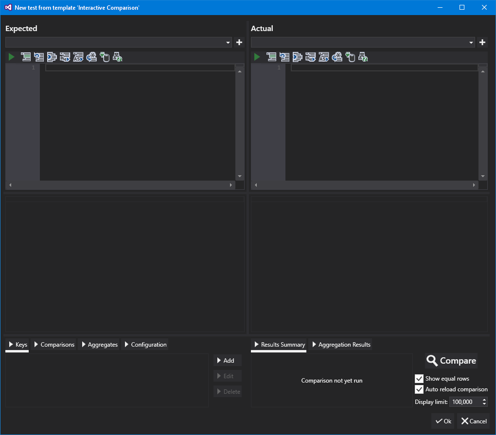
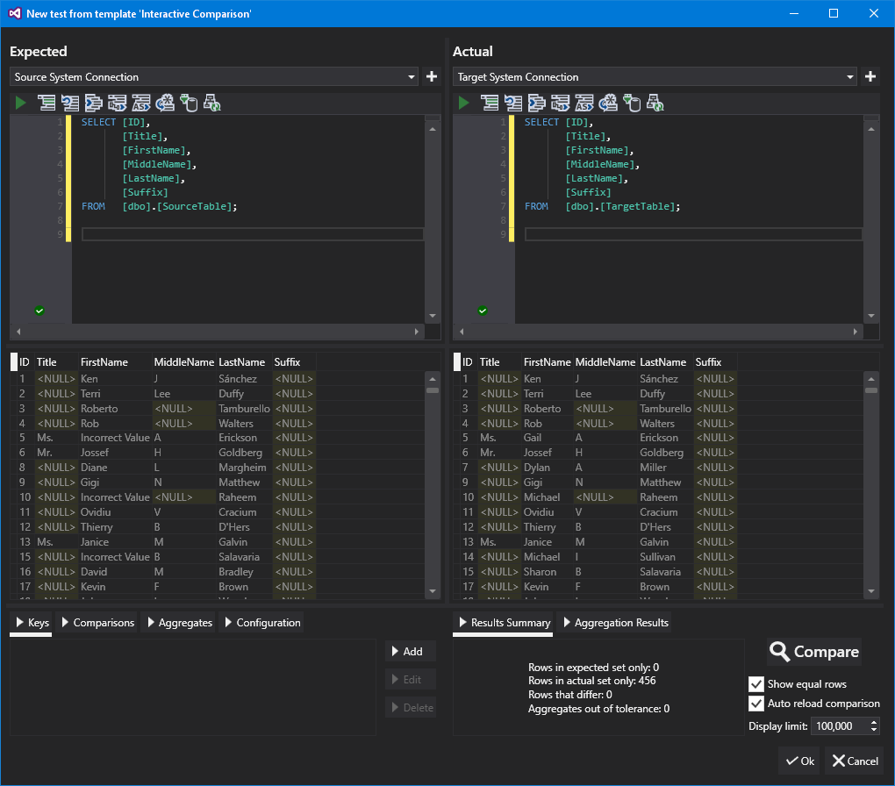
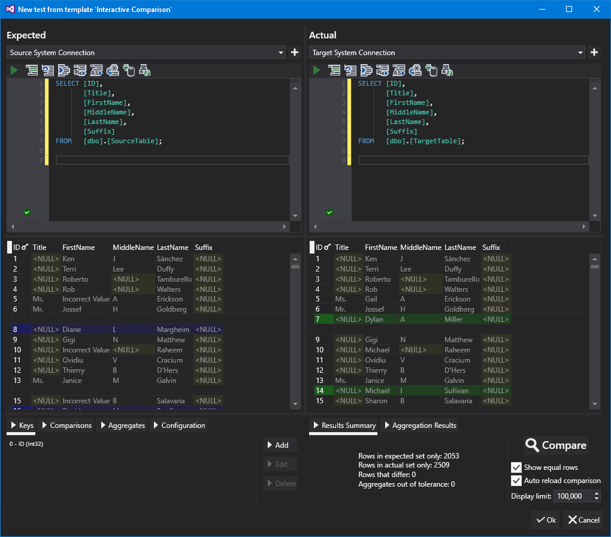
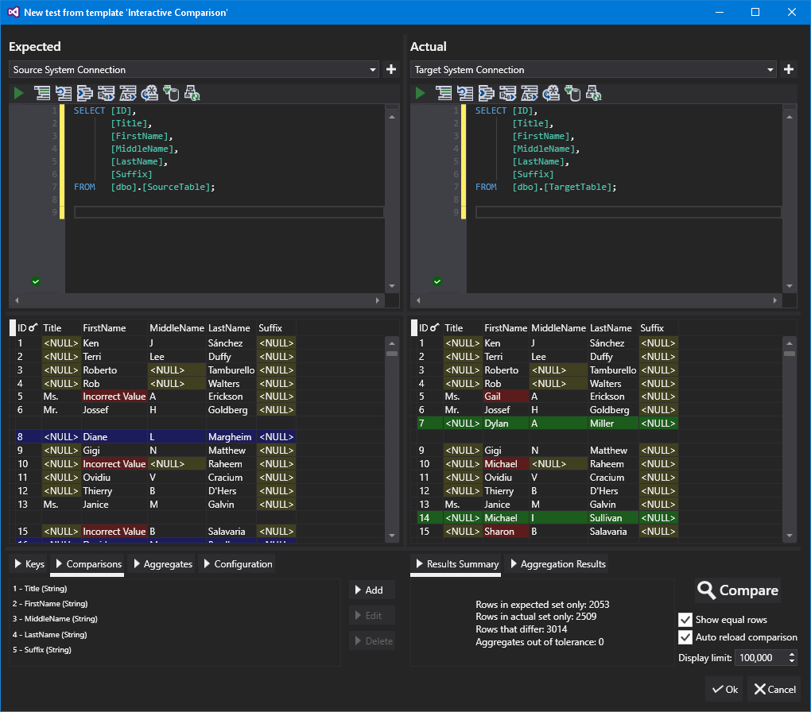
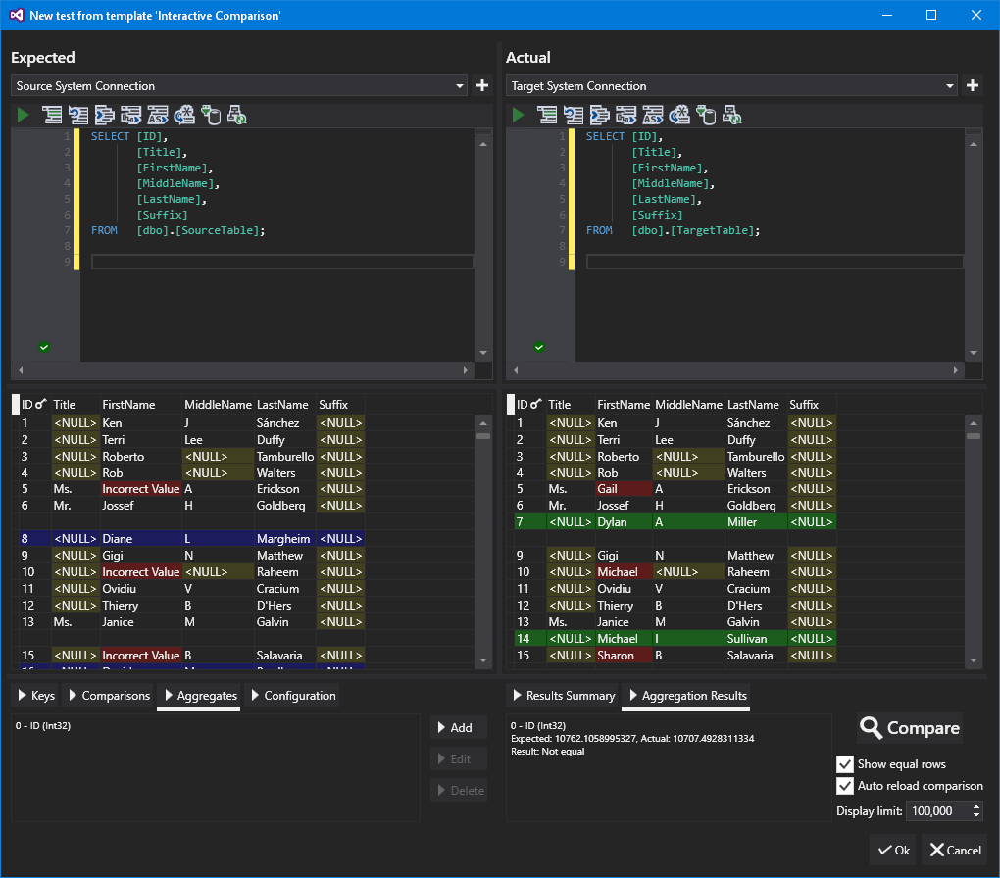
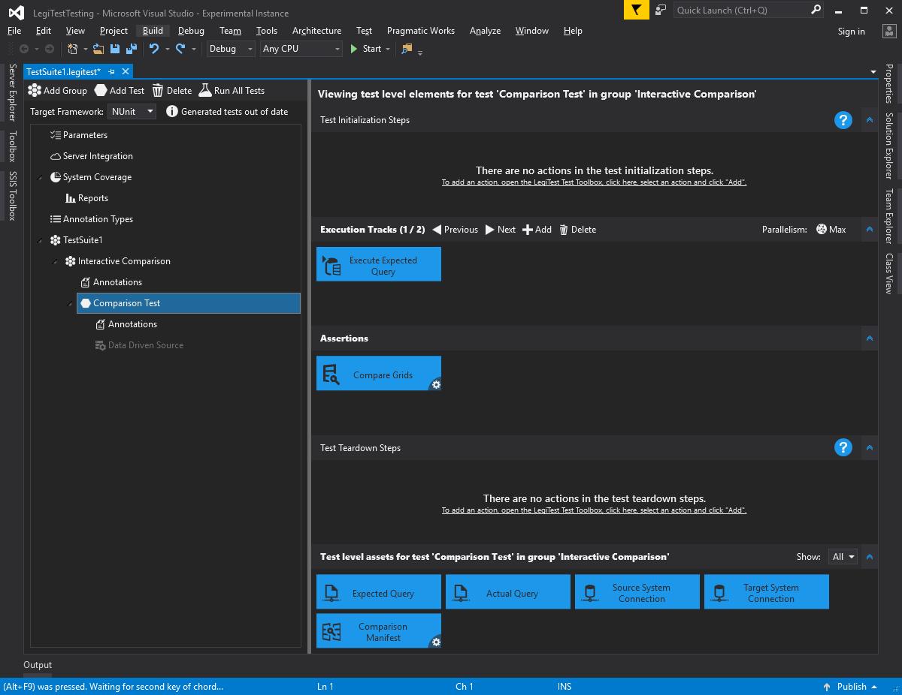



# Interactive Comparison

The interactive comparison wizard in LegiTest allows a data comparison to be built while inspecting the results that the comparison would produce. This shortens the cycle between intent and result and allows us to tailor the comparison.

When launched, the wizard presents an empty display.

To begin, we either select a connection or create a new connection for each side of the comparison. To create a new connection, click the ‘+’ button to the right of the connection selector. Note that once we have selected a connection, then the code completion becomes available in the editor if that connection is to a SQL Server instance.

When we have typed in our queries for the expected and actual sides of the comparison, we can click ‘Compare’ to run a comparison and the display shows the data.

Note that at the moment, all of the columns are faded out. This means that they are not part of the comparison. The first thing we need to do is define the key that uniquely identifies rows in the comparison, so we click on the column header of the column we want to be our key and select ‘Set as key’. If more than one column makes up the key, then we can click on the column header of each key column in turn and select ‘Add to keys’. Note that we can also add keys manually by clicking on the ‘Keys’ button and then the ‘Add’ button in the lower left panel.

The display can then show us rows that exist only in the expected or actual result sets, and highlights the full row on each side.

We can then click on ‘comparisons’ in the bottom right panel, and we are presented with a button allowing us to automatically map the comparison columns from the expected and actual sets. It does this by finding columns that have matching names and compatible types. Note that we can also add comparisons manually by clicking on the ‘Comparisons’ button and then the ‘Add’ button in the lower left panel. This is needed if you want to specify tolerances or match options for the comparison (e.g. numerics within 2% tolerance or string matching that ignores case). Once we have done this, we can see that all columns are now part of the comparison.

We can now see that values that are different are being compared and highlighted.

It is also possible to configure aggregates, so that you could, for example, ensure that the total of a column from the expected side is within 2% of the total from the actual side. To do this, click the ‘Aggregates’ button and then the ‘Add’ button in the lower left panel.

We can also view the results of aggregations by clicking on the ‘Aggregation Results’ button in the right hand panel.

We can also change the configuration of the comparison by clicking on the Configuration button in the lower left panel. This allows us to configure whether we ignore certain categories of difference and whether we use disk based sets. Disk based sets are used when we expect a large number of results from the server and want to keep the memory usage to a minimum. Note that when using disk based sets your query must return the rows in the order specified by your keys – as disk based sets cannot be sorted.

There are also configuration options in the right hand side panel. Note that the configuration options on the right hand side only apply to the operation of the wizard and do not change how the actual generated tests are executed. Here we can decide to show equal rows or not, automatically reload the comparison when we change things and set a limit on the number of rows.

If we have automatic reload configured, then the queries will not be re-run when changing the comparison configuration. They will only be run if:

- A different connection has been selected

- The query has changed

- The ‘Compare’ button is used.

When we are happy with our comparison configuration, we can click the ‘Finish’ button in order to generate the elements in our test:

Note that the ‘compare grids’ and ‘comparison manifest’ items have a quick action marker in the bottom right. Clicking this allows quick access to the interactive wizard to enable you to modify an existing comparison.

