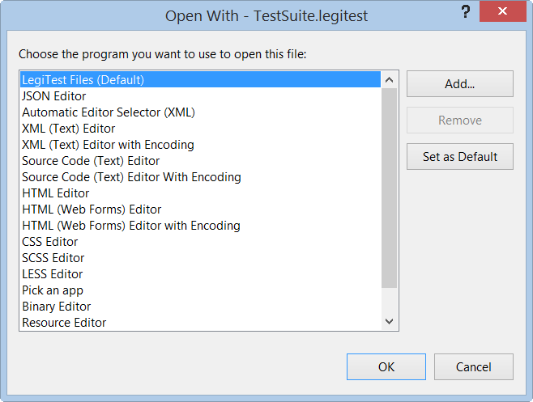



# Why are my LegiTest files showing XML?

If the .legitest file is opening as XML, then you will need to change which exe it is being opened with. To do so, right click the .legitest file and select open with..., in this dialog that is opened, you should see an item named LegiTest Files, select this and set as default. If the .legitest file is already open, you may need to close and re-open for the changes to be applied.

