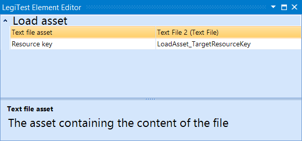



# Load Asset

The Load Asset action allows a user to load a text file into the resource bag so that it can be used in asserts. This helps to bypass the need of writing the content of the asset to a file before comparing it.

#### Load Asset Editor

**Text file asset -** The text file asset to be loaded.

**Resource Key -** The name of the resource key to be assigned.